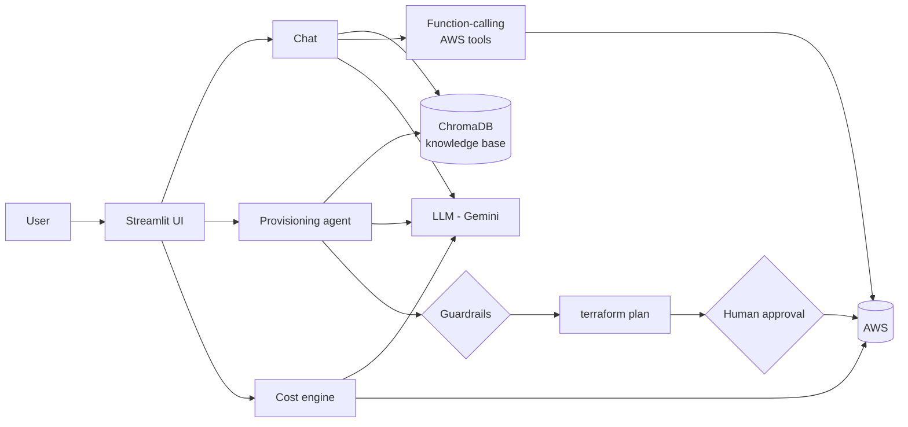

# devops-assistant
# AI-Powered DevOps Assistant


An AI assistant that answers DevOps questions from a team knowledge base (RAG), provisions AWS infrastructure with Terraform from plain English, manages live AWS resources through LLM function calling, and finds cloud cost savings, with guardrails and human approval on every change.

## Features

| Feature | What it does |
|---|---|
| **RAG chat** | Answers DevOps/AWS questions grounded in team policies and docs (ChromaDB vector search), with source citations |
| **Infrastructure provisioning** | Natural language → Terraform → `validate` → policy guardrails → `plan` → **human approval** → `apply` / `destroy` |
| **Live AWS tools** | LLM function calling with 6 boto3 tools (EC2, EBS, S3, CloudWatch, Cost Explorer); start/stop requires confirmation |
| **Cost optimization** | Read-only scan for idle EC2, unattached and gp2 EBS volumes, old snapshots, unused Elastic IPs, S3 without lifecycle rules and missing tags, with estimated monthly savings and an AI-written FinOps report |

## Architecture



## Safety design

1. **LLM rules:** the model is told the allowed resources, instance types and region, and replies `NOT_ALLOWED` instead of substituting something else.
2. **Code guardrails:** `check_guardrails()` blocks disallowed resource types, large instance types, other regions, SSH open to `0.0.0.0/0` and hard-coded credentials, even if the LLM gets it wrong.
3. **Human in the loop:** nothing is applied, started or stopped without an explicit Approve or Confirm click.
4. **Least privilege:** a dedicated IAM user; the cost engine is read-only; secrets live in `.env` and `~/.aws` and never enter Git or the Docker image.

## Tech stack

Python · Streamlit · Google Gemini API (LLM-agnostic design) · ChromaDB (RAG) · Terraform · AWS (boto3, EC2, S3, CloudWatch, Cost Explorer) · Docker / Docker Compose · GitHub Actions · pytest · ruff

## Screenshots

| RAG chat with sources | Terraform plan + approval |
|---|---|
|  |  |

| Guardrail refusal | Cost optimization report |
|---|---|
|  |  |

## Quick start

**Requirements:** Python 3.11, Terraform, AWS CLI configured (`aws configure`), a Gemini API key.

```bash
git clone https://github.com/priyankaraviiitdelhi-cpu/devops-assistant.git
cd devops-assistant
python3.11 -m venv venv && source venv/bin/activate
pip install -r requirements.txt
```

Create a `.env` file:

```
LLM_PROVIDER=gemini
LLM_MODEL=gemini-3.8-flash
GEMINI_API_KEY=your-key-here
```

Build the knowledge base and run the app:

```bash
python rag.py
streamlit run app.py
```

**Or with Docker:**

```bash
docker compose up -d --build
# open http://localhost:8501
```

## Project structure

```
app.py              Streamlit UI (Chat / Provision / Cost modes)
llm.py              LLM wrapper (provider switch via .env)
rag.py              Chunking, ChromaDB indexing and search
infra_agent.py      Terraform generation, guardrails, plan/apply/destroy
tools_agent.py      Function-calling AWS tools with confirmation gate
cost_agent.py       Cost scans, savings estimates, AI report
ui_provision.py     Provisioning page
ui_cost.py          Cost optimization page
data/docs/          Knowledge base (team policies, AWS and Terraform guides)
tests/              Unit tests (no AWS or LLM calls)
.github/workflows/  CI: lint, tests, Docker build
```

## Tests and CI

```bash
ruff check .
pytest -v
```

GitHub Actions runs lint, unit tests and a Docker image build on every push.

## Future work

- More resource types in the provisioning allowlist (VPC, IAM roles) with matching guardrails
- Remote Terraform state in S3 with locking
- Scheduled cost scans with Slack/email alerts
- Support for Claude and OpenAI providers in `llm.py`

> Savings figures are estimates based on approximate on-demand prices for ap-south-1.
